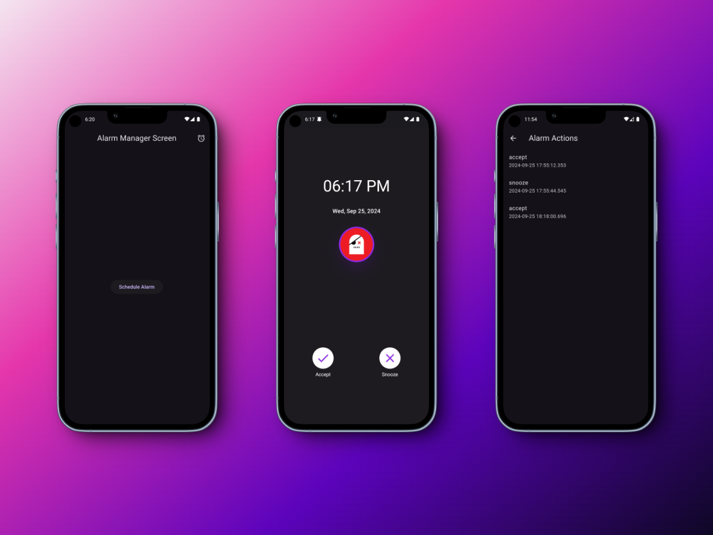

# Flutter Alarm Manager POC



## Overview

This project demonstrates the implementation of a robust background alarm scheduling system in a Flutter application. It utilizes method channels to communicate with native Android code, Jetpack Compose for the alarm notification UI, and a custom notification service for managing high-priority alarm notifications and display these notification full screen even from app-killed state and lock screen.

### Key Features

- Schedule alarms that run in the background.
- Display full screen notifications in Lock Screen and handling actions even in app-killed state
- Handle notification permissions.
- Use method channels for native code integration.
- Leverage Jetpack Compose for modern Android UI.
- Implement a persistent alarm system that works even when the app is closed.
- Custom notification service for creating and managing high-priority alarm notifications.

---

## Project Structure

### Flutter (Dart) Side

- `lib/main.dart`: The entry point of the Flutter application.
- `lib/alarm_manager_screen.dart`: The main screen for scheduling alarms.
- `lib/alarm_actions_screen.dart`: A screen to view and manage scheduled alarms.
- `lib/utils/alarm_method_channel.dart`: Dart side of the method channel for communicating with native Android code.
- `lib/hive/models/alarm_action.dart`: Data Model to store the alarm action selected with its timestamp.
- `lib/hive/service/database_service.dart`: Contains code related to Hive DB for Crud Operations

### Native Android (Kotlin) Side

- `android/app/src/main/kotlin/.../MainActivity.kt`: Main activity for the Flutter app, handles method channel communication.
- `android/app/src/main/kotlin/.../AlarmActivity.kt`: Activity for displaying and handling alarms.
- `android/app/src/main/kotlin/.../AlarmScreen.kt`: Jetpack Compose Screen hosted in AlarmActivity
- `android/app/src/main/kotlin/.../model/AlarmItem.kt`: Data model for alarm items.
- `android/app/src/main/kotlin/.../alarmScheduler/AlarmScheduler.kt`: Interface for alarm scheduling.
- `android/app/src/main/kotlin/.../alarmScheduler/AlarmSchedulerImpl.kt`: Implementation of the alarm scheduling system.

- `android/app/src/main/kotlin/.../AlarmNotificationService.kt`: Interface for the alarm notification service.
- `android/app/src/main/kotlin/.../AlarmNotificationServiceImpl.kt`: Implementation of the alarm notification service.

---

## Key Components

### `MainActivity`

Handles Flutter-native method channel communication. This is the entry point for all native-side interactions from Flutter.

### `AlarmActivity`

Displays and handles the alarm UI using Jetpack Compose. This is where the user interacts with the alarm (snooze, accept).

### `AlarmNotificationService`

Responsible for creating and managing high-priority notifications for alarms. It ensures that alarm notifications are persistent, even on the lock screen.

#### Key Responsibilities:

- **Notification Channel Creation**: Creates a high-importance channel for alarms. Sets channel properties to bypass "Do Not Disturb," show on the lock screen, and enable lights and vibration.
- **Showing Notifications**: Creates a full-screen intent that launches the `AlarmActivity`. Builds a high-priority notification with a full-screen intent. The notification is ongoing and non-cancelable to ensure it persists until user interaction.

```kotlin

 val notificationService: AlarmNotificationService = AlarmNotificationServiceImpl(context)

   val alarmItem = AlarmItem(
            id = 1,
            message = "Alarm has been ringing"
        )
// To display notification
notificationService.showNotification(AlarmItem(alarmId, message))

```

- **Cancelling Notifications**: Cancels a notification by its ID when alarms are dismissed or snoozed.

```kotlin

 val notificationService: AlarmNotificationService = AlarmNotificationServiceImpl(context)

   val alarmItem = AlarmItem(
            id = 1,
            message = "Alarm has been ringing"
        )
// To cancel notification
notificationService.showNotification(AlarmItem(alarmId, message))

```

---

## Alarm Scheduler

The `AlarmScheduler` interface and its implementation, `AlarmSchedulerImpl`, provide a simple and effective way to schedule and cancel alarms in an Android app.

### Key Responsibilities:

- **Scheduling and Canceling Alarms**: The `AlarmScheduler` is responsible for scheduling alarms to trigger at a specific time. It ensures that the necessary system components, such as `AlarmManager`, are used correctly to wake the device and trigger the alarm on time.

```kotlin

   val alarmScheduler = AlarmSchedulerImpl(context)
   val alarmItem = AlarmItem(
            id = 1,
            message = "Alarm has been ringing"
        )
   // To schedule full screen notification alarms
   alarmScheduler.schedule(alarmItem)

```

- **Handling Exact Timings**: The scheduler is designed to handle precise alarm timings using Android's `AlarmManager.setExact()` method, which is suitable for alarms requiring exact triggers.

- **Canceling Alarms**: The `AlarmScheduler` also provides functionality to cancel scheduled alarms. It ensures that any pending intents related to the alarm are properly canceled, preventing unnecessary alarms from firing.

```kotlin

   val alarmScheduler = AlarmSchedulerImpl(context)
   val alarmItem = AlarmItem(
            id = 1,
            message = "Alarm has been ringing"
        )

   // To cancel alarm
   alarmScheduler.cancel(alarmItem)

```

- **Managing Alarm Intents**: The `AlarmScheduler` is responsible for creating and managing `PendingIntent` objects that represent the scheduled alarms. These intents are used by the `AlarmManager` to trigger the alarm at the specified time.

## AlarmReceiver

The `AlarmReceiver` is a crucial component in the alarm management system. It extends `BroadcastReceiver`, enabling the app to respond to system-wide broadcast events, specifically alarms that are triggered by the `AlarmManager`.

### Key Responsibilities

**Receiving Broadcasts:**

- The primary role of `AlarmReceiver` is to listen for broadcasts triggered when an alarm goes off, even if the app is in the background or closed.
- It receives `Intents` with alarm details such as the `ALARM_ID` and the `ALARM_MESSAGE`.

**Handling the Alarm:**

- Once the alarm is received, it extracts the `ALARM_ID` and `ALARM_MESSAGE` from the `Intent`. If no values are provided, defaults are used (`-1` for `ALARM_ID` and `"Alarm!"` for the message).
- It then creates an `AlarmItem` object to represent the triggered alarm.

**Displaying Notifications:**

- After receiving the alarm, the receiver creates an instance of `AlarmNotificationService` and invokes its `showNotification` method, which displays a notification to the user about the alarm.

```kotlin
class AlarmReceiver : BroadcastReceiver() {


    override fun onReceive(context: Context, intent: Intent?) {
        val alarmId = intent?.getIntExtra("ALARM_ID", -1) ?: -1
        val message = intent?.getStringExtra("ALARM_MESSAGE") ?: "Alarm!"
        val notificationService: AlarmNotificationService = AlarmNotificationServiceImpl(context)
        notificationService.showNotification(AlarmItem(alarmId, message))
    }
}

```

---

## Alarm Notification Flow


<p style="text-align:center; font-weight:bold;">Flow of Notification Handling</p>

### 1. **Alarm Set from Flutter**

- The alarm is initially scheduled from the Flutter side using a **Method Channel**.
- Flutter sends a command to the native Android layer to schedule the alarm using the `AlarmScheduler`.

### 2. **Alarm Trigger and Notification Creation**

- When the scheduled time arrives, the alarm triggers, and the `AlarmReceiver` captures the broadcast.
- The receiver then creates an alarm notification via `AlarmNotificationService`, which shows a high-priority, full-screen notification on the device.
- The notification appears even if the device is locked.

### 3. **User Interaction with the Alarm**

- When the user interacts with the notification (e.g., accepting or snoozing), the `AlarmActivity` is launched.
- Inside `AlarmActivity`, the notification content is displayed via a Jetpack Compose `AlarmScreen` interface.
- The user can either **accept** or **snooze** the alarm, and these actions are captured within the `AlarmActivity`.

### 4. **Handling Accept or Snooze Action**

- Based on the user's action:
  - **Accept**: The `alarmAccepted` method is invoked via the Method Channel, and the alarm is marked as accepted.
  - **Snooze**: The `alarmSnoozed` method is called, which reschedules the alarm for a later time using the `AlarmScheduler`.
- In both cases, the notification is cancelled after the action is completed.

### 5. **Sending Action Back to Flutter**

- After the user selects either **accept** or **snooze**, the result of the action is sent back to the Flutter layer through the Method Channel.
- The Method Channel passes the action result (accept or snooze) back to Flutter, where it can be processed for further logic.

### 6. **Storing the Action in Local Storage (Hive DB)**

- Once the action result is received in Flutter, it is stored locally in the **Hive DB**.
- Hive is used to store key details like:
  - Whether the alarm was accepted or snoozed.
  - Timestamps of the actions for future reference or history tracking.
- This ensures that the user's interaction with the alarm is saved persistently, even if the app was closed or in a killed state when the alarm was triggered.

### Key Points:

- **Persistent Storage**: Using Hive for local storage ensures that even in cases where the app was closed, the alarm actions are reliably saved.
- **Flutter-Android Communication**: The **Method Channel** serves as the bridge for communication between the Flutter and native Android sides, ensuring seamless action handling and data transmission.
- **State Handling**: The system handles alarms gracefully, whether the app is in a running state or was previously killed, ensuring that alarms work in all scenarios.

---

## Permissions

### The app requires the following permissions to function correctly:

```xml
    <uses-permission android:name="android.permission.POST_NOTIFICATIONS" />
    <uses-permission android:name="android.permission.SCHEDULE_EXACT_ALARM" />
    <uses-permission android:name="android.permission.USE_EXACT_ALARM" />
    <uses-permission android:name="android.permission.WAKE_LOCK" />
    <uses-permission android:name="android.permission.USE_FULL_SCREEN_INTENT" />
```

### Also add the following in the Notification Activity in your Manifest

```xml
   <activity
      android:name=".activity.AlarmActivity"
      android:showWhenLocked="true"
      android:turnScreenOn="true"
      android:exported="false" />

```

# Contributing

### Contributions are welcome! Please feel free to submit a Pull Request.

----
